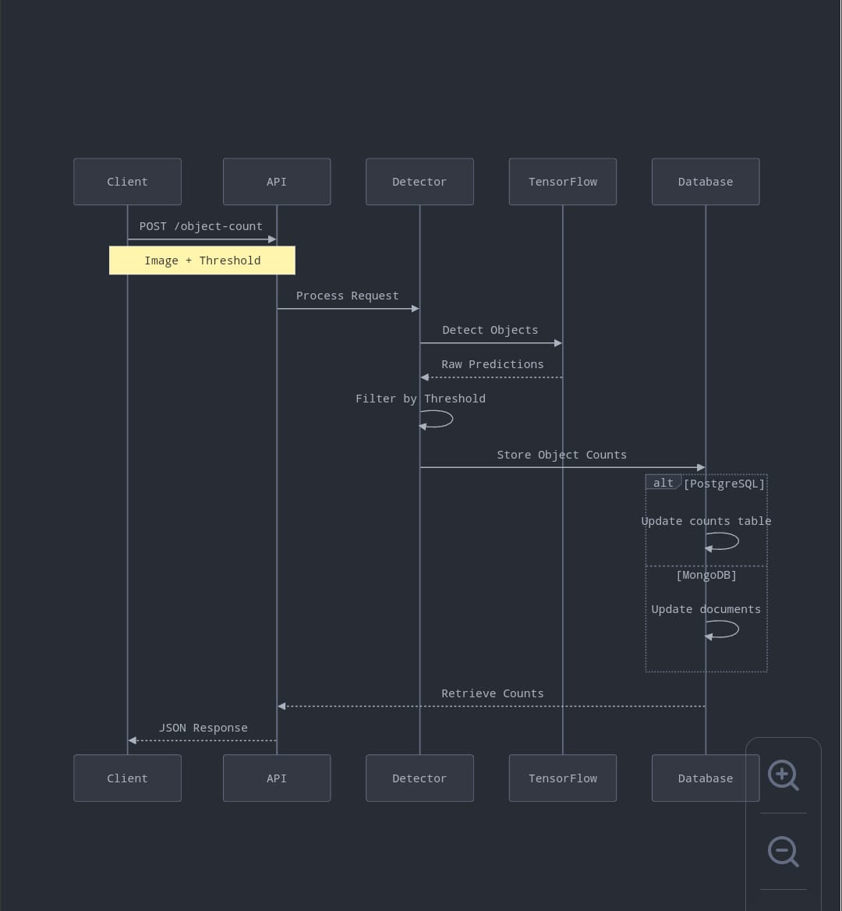

# NIQ Innovation Enablement - Challenge 1 (Object Counting)

## Task 1: Add New Service Endpoint
1. Added a new service endpoint to receive an image and the desired threshold, returning a list of predictions.
2. The endpoint `object-counter-pg` is added in `counter/entrypoints/webapp.py`.
3. Implemented proper error handling for the endpoint.

## Task 2: Add New Adapter for Postgres DB
1. Created a new adapter for PostgreSQL to store captured metadata.
2. **Table Details:**
   - **Table Name:** `object_counts`
   - **Columns:**
     - `id` (Primary Key)
     - `object_class` (VARCHAR)
     - `count` (INTEGER)
     - `updated_at` (TIMESTAMP)
3. The `count` column updates if the same `object_class` is detected in another image.
4. The adapter is responsible for:
   - Upserting captured metadata into the table.
   - Retrieving metadata from the table.

## Task 3: Code Review and Improvements

### Code Review
- The code follows **Hexagonal Architecture**.

- The application is composed by 3 layers:

- **entrypoints**: This layer is responsible for exposing the API and receiving the requests. It is also responsible for validating the requests and returning the responses.

- **adapters**: This layer is responsible for the communication with the external services. It is responsible for translating the domain objects to the external services objects and vice-versa.

- **domain**: This layer is responsible for the business logic. It is responsible for orchestrating the calls to the external services and for applying the business rules.


### Architecture



### Improvements
1. Add an **admin endpoint** to provide a holistic view of all detected objects
2. Improve **error handling** and add env files to seperate dev and prod environment variables.
3. Implement **Streamlit** as a user-friendly interface for the API.
4. Reduce **manual setup effort** for the project.Reduce number of steps involved suring setup
5. Implement **batch processing** to allow multiple images for object detection.
6. Introduce **API authentication** using a JWT token. 
7. Store **model inference metadata** including detection time.
8. **Logging** can be added.

## Task 4: Implement proposed Improvements

Implemeted 5 improvements:
1. **Admin Endpoint** Provides a holistic view of all detected objects.
2. **Error handling** and **env files addition**.
3. **Batch processing** Allows multiple images for object detection. 
4. **Manual setup effort** Reduce number of steps involved suring setup 
5. **Streamlit** as a user-friendly interface for the API.

## Task 5: Multiple models addition

If we want to use multiple models trained internally (not public), what would you
change in the setup of the project?

**Integrating an Open-Source Model**
1. If adding another open-source TensorFlow model, ensure it runs inside a Docker container.
2. Place the model inside tmp/models/<model_name>/1. This directory must contain the model.pb file.
3. Update model_config.config to include the configuration for the newly added model.
4. The locally stored model at tmp/models/<model_name>/1 should be mapped to /models/<model_name> inside the Docker container.

**Integrating Internally Trained Models**
1. Store all internally trained models inside the tmp/model directory.

Directory Structure Changes:
```
tmp/
├── model/
│   ├── rfcn/           # Public model
│   ├── custom_model1/  # Internal model 1
│   └── custom_model2/  # Internal model 2
```
2. Implement an adapter for the internally trained model (e.g., TFSObjectDetector), similar to how TensorFlow models are served.
3. Modify the API to accept model_name as an input parameter.
4. Based on the provided model name, the API should route the request to the corresponding adapter. The adapter will handle object detection and return the response accordingly.

## Task 6: 

1. **Unit test**: Adjusted one test case to test new endpoint.
2. **Object detection using different deep learning frameworks** 
- Since the architecture followed is Hexagonal architecture, Support models for object detection using different deep learning frameworks is easy and efficient.
- Like Tensorflow serving, there are other deep learning frameworks that are used to detect objects. One of them is Pytorch(YOLOv5).
- Similar to tensorflow object detector, we need to write a new adapter for the other deep learning framework.
- Based on the model name, the API can do object detection. It selects the adapter accordingly and infer the results.
- The model is to be added at the correct location which is tmp/models/<new_model>/1/